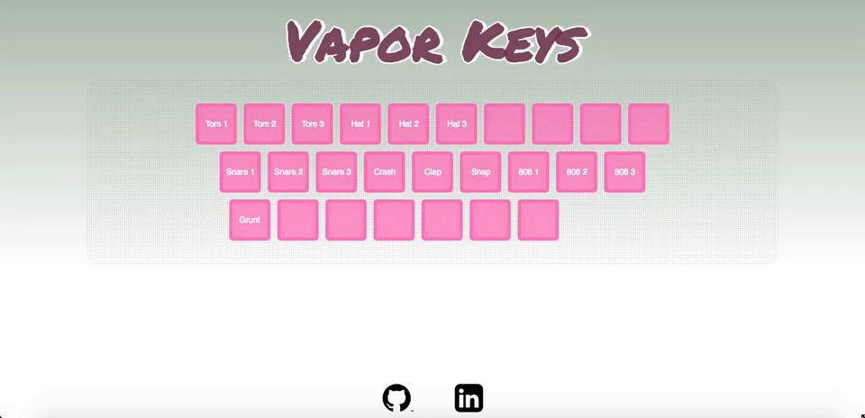

# Vapor Keys
[Vapor Keys](https://vapor-keys.herokuapp.com/) is a keyboard emulator for making beats.



With vapor keys you can let your creativity flow from your brain to your finger tips and create art! This art could be the music you produce, but if that music isn't that great your art will be the cool visualizations that are produced on each key stroke!

# Technology
This single page app is made with Javascript, HTML5, CSS3 and the Web Audio API.

# Implementation

Vapor Keys will access an audio file on each keypress and generates real-time audio visualizations. That means when each sound is played the frequencies for that sound are being grabbed and used to determine the height of each bar in the visualization which is then animated via HTML5 canvas.


```javascript
// An example of how the visualization
// animation is created
let renderFrame = () => {
  requestAnimationFrame(renderFrame);

  x = 0;
  analyser.getByteFrequencyData(dataArray);
  ctx.fillStyle = "white"
  ctx.fillRect(0, 0, WIDTH, HEIGHT);

  // this loop will iterate through a list of
  // frequencies and create a bar for each one
  for (let i = 0; i < bufferLength; i ++) {
    // bar height determined by frequency
    barHeight = dataArray[i];

    // gives a unique color depending on the height
    let r = barHeight + (25 * (i/bufferLength));
    let g = 50 * (i/bufferLength);
    let b = 100;

    ctx.fillStyle = `rgb(${r}, ${g}, ${b}`;
    ctx.fillRect(x,HEIGHT - barHeight, barWidth, barHeight)

    x += barWidth + 1;
  }
```


### Future features

I would like to be able to add these features at some point.
- [ ] Add multiple sound sets
- [ ] Allow users to record and download there audio samples
- [ ] Incorporate a backend and include users
